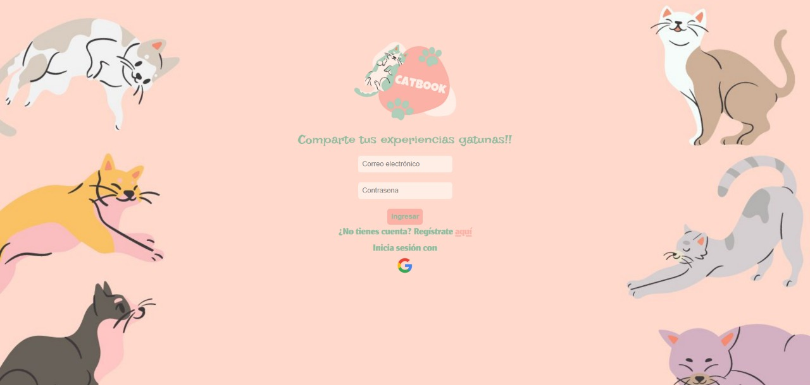
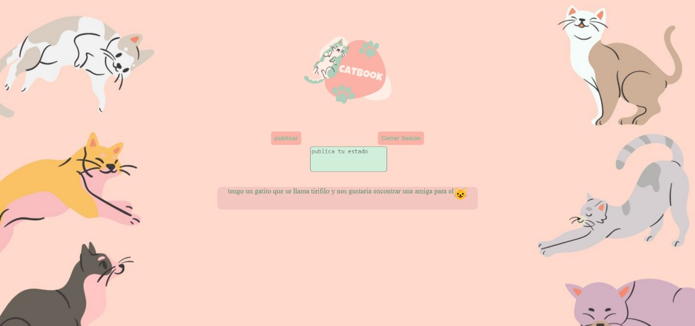
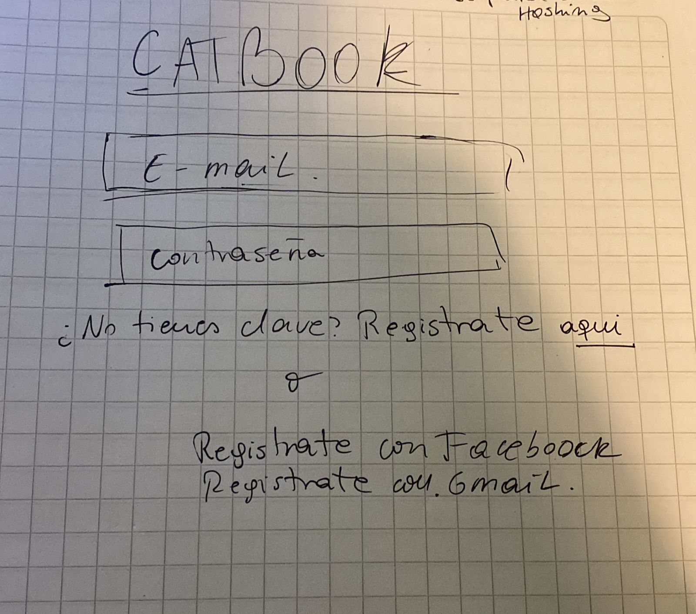
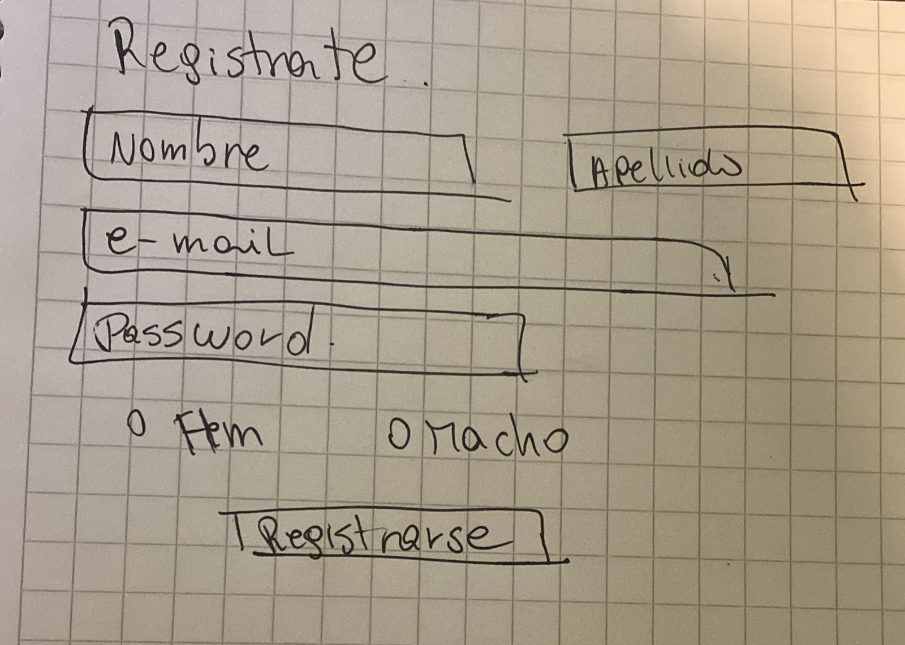
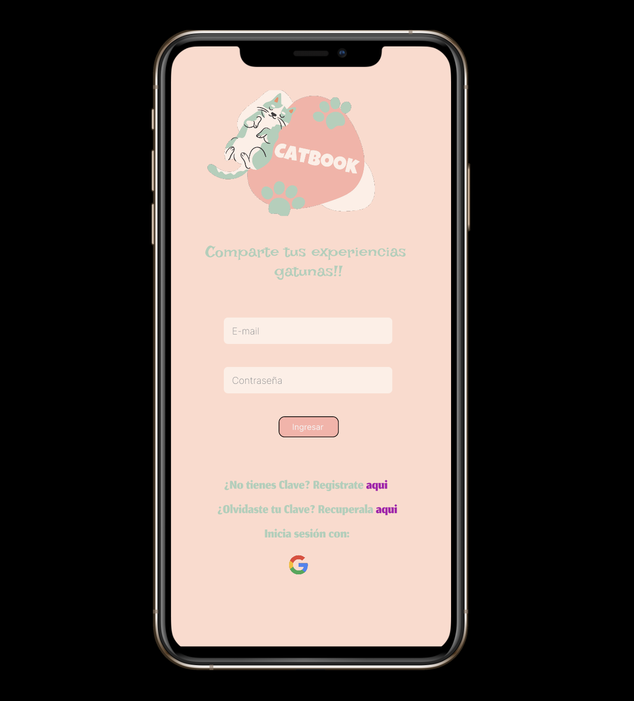

# **Red Social - CatBook**

## Definición del producto
Catbook es una red social orientada a los amantes de los gatos donde podemos:

*Registrarnos con correo electrónico más clave o solo registrarse con google.
*Ingresar como usuario con correo electrónico y clave o solo por google si el usuario lo decida.
*Ingresar al muro
*Postear y ver posteos de otros usuarios.
*Cerrar Sesión.

## Imagen final del sitio

En las siguientes imágenes se mostrarán todas las ventanas de nuestro sitio.

Página de inicio que nos permite loguearse.

Página para poder registrarse con correo electrónico o gmail.

Muro principal, donde se pueden visualizar los posts y los usuarios registrados pueden publicar sus propias historias.

### El usuario
Se analizó y priorizó a través de encuestas resolver las problemáticas para las personas que quieren tener un lugar para compartir experiencias de sus gatos.

## Historias de usuario

**HU1**:Yo como catlover deseo registrarme en la página para que solo me encuentre con amantes de los gatos.
**Definición de terminado**:La HU1 estará terminada cuando usuario pueda registrarse en la red social.

**HU2**:Yo como usuario de la red social deseo poder loguearme para ver el muro.
**Definición de terminado**:La HU2 estará terminada cuando el usuario pueda loguearse para ver el muro.

**HU3**:Yo como usuario logueado deseo poder publicar en el muro para que otros catlovers puedan ver.
**Definición de terminado**:La HU3 estará terminada cuando el usuario pueda publicar en el muro.

## Diseño de la interfaz de usuario

### Prototipo de baja fidelidad

El prototipo de baja fidelidad fue el primer boceto realizado con papel y lápiz de la interfaz de usuario.

### Prototipo de alta fidelidad

El prototipo de alta fidelidad fue realizado a través de figma, centrándonos en la versión mobile first prototipada.

https://www.figma.com/file/ljavwsxrWOFaH8eWlF0DNx/red-social-cat-team-library?node-id=0%3A1

Producto prototipado:

https://www.figma.com/proto/ljavwsxrWOFaH8eWlF0DNx/red-social-cat-team-library?node-id=413%3A3&scaling=scale-down&page-id=0%3A1&starting-point-node-id=413%3A3

